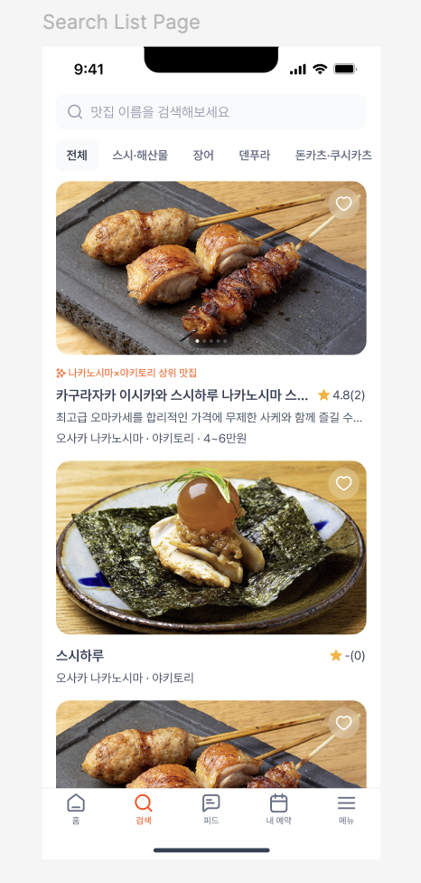

# Coding Test Assignment

### Coding Test Assignment: Full Stack Developer Challenge

### Objective

Create a simple web application that allows users to view a list of restaurants. The application should consist of a frontend built with React and TypeScript, and a backend API built with TRPC. The application should allow users to:

- View a list of restaurants
- Mark a restaurant as a favorite

### Requirements

### Frontend

1. **React and TypeScript**: The frontend should be built using React and TypeScript.
2. **Restaurant List**: Display a list of restaurants with reference to the provided Figma design. Each restaurant should have a name, description, rating, and an image.
3. **Mark as Favorite**: Allow users to mark a restaurant as a favorite. Favorites should be indicated with a heart icon.
4. UI Component library: Recommend using a UI component library for React that you are familiar with

https://www.figma.com/design/rcomlVLL8LS3xfUVSXkCUY/Seoul-Comix-Full-Stack-Applicant-Coding-Test-Assignment--Design-Material?node-id=0-1&t=w7hYgZ8xNW6W4Uwj-1

- Preview
  

### Backend

1. **TRPC**: The backend should be built using TRPC. If you are using nextjs, use edge functions to serve trpc endpoint.
2. **Database**: Use PostgreSQL to store restaurant data.
3. **Prisma ORM**: Use Prisma as the ORM for database interactions.
4. **Mock Data**: Use the provided mock data for the restaurant list. This data should be stored in the PostgreSQL database.
5. **API Endpoints**: Implement the following TRPC procedures:
   - `getRestaurants`: Retrieve all restaurants
   - `addFavorite`: Mark a restaurant as a favorite

### Additional Considerations

1. **Next.js**: If comfortable, use Next.js for server-side rendering.
2. **Prisma**: Use Prisma for database ORM. This is a mandatory requirement.

### Mock Data

You will be provided with a mock data set for the list of restaurants. This data should be used to populate your PostgreSQL database.

- Mock Data (Restaurant list)
  The image URLs provided are not actual image addresses. Please replace them with appropriate images.
  ```json
  [
    {
      "rating": 4.2,
      "rating_count": 139,
      "category": "YAKITORI",
      "city": "osaka",
      "desc": "최고급 오마카세를 합리적인 가격에 무제한 사케와 함께 즐길 수 있는",
      "id": "4dc2e1d1-fe89-4a29-b86a-f8bb0ce1395d",
      "images": [
        "https://images.unsplash.com/photo-1555939594-58d7cb561ad1?q=80&w=1887&auto=format&fit=crop&ixlib=rb-4.0.3&ixid=M3wxMjA3fDB8MHxwaG90by1wYWdlfHx8fGVufDB8fHx8fA%3D%3D",
        "https://images.unsplash.com/photo-1555939594-58d7cb561ad1?q=80&w=1887&auto=format&fit=crop&ixlib=rb-4.0.3&ixid=M3wxMjA3fDB8MHxwaG90by1wYWdlfHx8fGVufDB8fHx8fA%3D%3D",
        "https://images.unsplash.com/photo-1555939594-58d7cb561ad1?q=80&w=1887&auto=format&fit=crop&ixlib=rb-4.0.3&ixid=M3wxMjA3fDB8MHxwaG90by1wYWdlfHx8fGVufDB8fHx8fA%3D%3D"
      ],
      "name": "카구라자카 이시카와 스시하루 나카노시마 스시야 카구라자카 이시카와 스시하루 나카노시마 스시야",
      "price_range": "3~5",
      "featured": {
        "text": "나카노시마×야키토리 상위 맛집",
        "icon": "stars-02"
      },
      "isFavorite": true
    },
    {
      "rating": 4.5,
      "rating_count": 200,
      "category": "SUSHI",
      "city": "tokyo",
      "desc": "신선한 해산물과 정통 스시를 제공하는",
      "id": "6ac3e2d1-ge98-5a29-c86a-g9cc1de2396d",
      "images": [
        "https://images.unsplash.com/photo-1547592180-2f1a1b3c3b68?q=80&w=1887&auto=format&fit=crop&ixlib=rb-4.0.3&ixid=M3wxMjA3fDB8MHxwaG90by1wYWdlfHx8fGVufDB8fHx8fA%3D%3D",
        "https://images.unsplash.com/photo-1547592180-2f1a1b3c3b68?q=80&w=1887&auto=format&fit=crop&ixlib=rb-4.0.3&ixid=M3wxMjA3fDB8MHxwaG90by1wYWdlfHx8fGVufDB8fHx8fA%3D%3D",
        "https://images.unsplash.com/photo-1547592180-2f1a1b3c3b68?q=80&w=1887&auto=format&fit=crop&ixlib=rb-4.0.3&ixid=M3wxMjA3fDB8MHxwaG90by1wYWdlfHx8fGVufDB8fHx8fA%3D%3D"
      ],
      "name": "스시 긴자 이시카와",
      "price_range": "4~6",
      "featured": {
        "text": "도쿄의 상위 스시 맛집",
        "icon": "stars-02"
      },
      "isFavorite": false
    },
    {
      "rating": 4.7,
      "rating_count": 180,
      "category": "RAMEN",
      "city": "kyoto",
      "desc": "진한 국물과 다양한 토핑을 자랑하는",
      "id": "7bd4f3e2-hf98-6b39-d87b-h0dd2ee2397e",
      "images": [
        "https://images.unsplash.com/photo-1586190848861-99aa4a171e90?q=80&w=1887&auto=format&fit=crop&ixlib=rb-4.0.3&ixid=M3wxMjA3fDB8MHxwaG90by1wYWdlfHx8fGVufDB8fHx8fA%3D%3D",
        "https://images.unsplash.com/photo-1586190848861-99aa4a171e90?q=80&w=1887&auto=format&fit=crop&ixlib=rb-4.0.3&ixid=M3wxMjA3fDB8MHxwaG90by1wYWdlfHx8fGVufDB8fHx8fA%3D%3D",
        "https://images.unsplash.com/photo-1586190848861-99aa4a171e90?q=80&w=1887&auto=format&fit=crop&ixlib=rb-4.0.3&ixid=M3wxMjA3fDB8MHxwaG90by1wYWdlfHx8fGVufDB8fHx8fA%3D%3D"
      ],
      "name": "라멘 이치란",
      "price_range": "2~4",
      "featured": {
        "text": "교토의 라멘 명소",
        "icon": "stars-02"
      },
      "isFavorite": true
    },
    {
      "rating": 4.3,
      "rating_count": 220,
      "category": "TEMPURA",
      "city": "nagoya",
      "desc": "바삭한 텐푸라를 맛볼 수 있는",
      "id": "8ce5g4f3-jg09-7c40-e98c-i1ee3ff3408f",
      "images": [
        "https://images.unsplash.com/photo-1604908177732-40aa343c3f2b?q=80&w=1887&auto=format&fit=crop&ixlib=rb-4.0.3&ixid=M3wxMjA3fDB8MHxwaG90by1wYWdlfHx8fGVufDB8fHx8fA%3D%3D",
        "https://images.unsplash.com/photo-1604908177732-40aa343c3f2b?q=80&w=1887&auto=format&fit=crop&ixlib=rb-4.0.3&ixid=M3wxMjA3fDB8MHxwaG90by1wYWdlfHx8fGVufDB8fHx8fA%3D%3D",
        "https://images.unsplash.com/photo-1604908177732-40aa343c3f2b?q=80&w=1887&auto=format&fit=crop&ixlib=rb-4.0.3&ixid=M3wxMjA3fDB8MHxwaG90by1wYWdlfHx8fGVufDB8fHx8fA%3D%3D"
      ],
      "name": "텐푸라 마츠야",
      "price_range": "3~5",
      "featured": {
        "text": "나고야 최고의 텐푸라집",
        "icon": "stars-02"
      },
      "isFavorite": false
    },
    {
      "rating": 4.6,
      "rating_count": 190,
      "category": "SOBA",
      "city": "fukuoka",
      "desc": "쫄깃한 면발과 진한 육수를 자랑하는",
      "id": "9df6h5g4-kh10-8d41-f09d-j2ff4gg4519g",
      "images": [
        "https://images.unsplash.com/photo-1570544826585-8dd0cf1d2aa8?q=80&w=1887&auto=format&fit=crop&ixlib=rb-4.0.3&ixid=M3wxMjA3fDB8MHxwaG90by1wYWdlfHx8fGVufDB8fHx8fA%3D%3D",
        "https://images.unsplash.com/photo-1570544826585-8dd0cf1d2aa8?q=80&w=1887&auto=format&fit=crop&ixlib=rb-4.0.3&ixid=M3wxMjA3fDB8MHxwaG90by1wYWdlfHx8fGVufDB8fHx8fA%3D%3D",
        "https://images.unsplash.com/photo-1570544826585-8dd0cf1d2aa8?q=80&w=1887&auto=format&fit=crop&ixlib=rb-4.0.3&ixid=M3wxMjA3fDB8MHxwaG90by1wYWdlfHx8fGVufDB8fHx8fA%3D%3D"
      ],
      "name": "우동 타로",
      "price_range": "2~4",
      "featured": {
        "text": "후쿠오카 우동 맛집",
        "icon": "stars-02"
      },
      "isFavorite": true
    },
    {
      "rating": 4.1,
      "rating_count": 160,
      "category": "YAKITORI",
      "city": "osaka",
      "desc": "맛있고 저렴한 야키토리 전문점",
      "id": "0eg7i6h5-lj21-9e52-g10e-k3gg5hh5620h",
      "images": [
        "https://images.unsplash.com/photo-1553621042-f6e147245754?q=80&w=1887&auto=format&fit=crop&ixlib=rb-4.0.3&ixid=M3wxMjA3fDB8MHxwaG90by1wYWdlfHx8fGVufDB8fHx8fA%3D%3D",
        "https://images.unsplash.com/photo-1553621042-f6e147245754?q=80&w=1887&auto=format&fit=crop&ixlib=rb-4.0.3&ixid=M3wxMjA3fDB8MHxwaG90by1wYWdlfHx8fGVufDB8fHx8fA%3D%3D",
        "https://images.unsplash.com/photo-1553621042-f6e147245754?q=80&w=1887&auto=format&fit=crop&ixlib=rb-4.0.3&ixid=M3wxMjA3fDB8MHxwaG90by1wYWdlfHx8fGVufDB8fHx8fA%3D%3D"
      ],
      "name": "야키토리 하치베",
      "price_range": "1~3",
      "featured": {
        "text": "오사카 야키토리 숨은 맛집",
        "icon": "stars-02"
      },
      "isFavorite": false
    },
    {
      "rating": 4.8,
      "rating_count": 250,
      "category": "SUSHI",
      "city": "sapporo",
      "desc": "신선한 해산물로 만든 정통 스시를 즐길 수 있는",
      "id": "1fh8j7i6-mk32-0f63-h11f-l4hh6ii6731i",
      "images": [
        "https://images.unsplash.com/photo-1551218808-94e220e084d2?q=80&w=1887&auto=format&fit=crop&ixlib=rb-4.0.3&ixid=M3wxMjA3fDB8MHxwaG90by1wYWdlfHx8fGVufDB8fHx8fA%3D%3D",
        "https://images.unsplash.com/photo-1551218808-94e220e084d2?q=80&w=1887&auto=format&fit=crop&ixlib=rb-4.0.3&ixid=M3wxMjA3fDB8MHxwaG90by1wYWdlfHx8fGVufDB8fHx8fA%3D%3D",
        "https://images.unsplash.com/photo-1551218808-94e220e084d2?q=80&w=1887&auto=format&fit=crop&ixlib=rb-4.0.3&ixid=M3wxMjA3fDB8MHxwaG90by1wYWdlfHx8fGVufDB8fHx8fA%3D%3D"
      ],
      "name": "스시 사토",
      "price_range": "4~6",
      "featured": {
        "text": "삿포로 스시 맛집",
        "icon": "stars-02"
      },
      "isFavorite": true
    },
    {
      "rating": 4.4,
      "rating_count": 170,
      "category": "RAMEN",
      "city": "hiroshima",
      "desc": "깊은 맛의 국물과 탱탱한 면발을 자랑하는",
      "id": "2gi9k8j7-nl43-1g74-i22g-m5ii7jj7842j",
      "images": [
        "https://images.unsplash.com/photo-1504544750208-dc0358e63f7f?q=80&w=1887&auto=format&fit=crop&ixlib=rb-4.0.3&ixid=M3wxMjA3fDB8MHxwaG90by1wYWdlfHx8fGVufDB8fHx8fA%3D%3D",
        "https://images.unsplash.com/photo-1504544750208-dc0358e63f7f?q=80&w=1887&auto=format&fit=crop&ixlib=rb-4.0.3&ixid=M3wxMjA3fDB8MHxwaG90by1wYWdlfHx8fGVufDB8fHx8fA%3D%3D",
        "https://images.unsplash.com/photo-1504544750208-dc0358e63f7f?q=80&w=1887&auto=format&fit=crop&ixlib=rb-4.0.3&ixid=M3wxMjA3fDB8MHxwaG90by1wYWdlfHx8fGVufDB8fHx8fA%3D%3D"
      ],
      "name": "라멘 타츠야",
      "price_range": "2~4",
      "featured": {
        "text": "히로시마 라멘 추천",
        "icon": "stars-02"
      },
      "isFavorite": false
    },
    {
      "rating": 4.9,
      "rating_count": 300,
      "category": "TEMPURA",
      "city": "yokohama",
      "desc": "고급스러운 텐푸라를 제공하는",
      "id": "3hj0l9k8-om54-2h85-j33h-n6jj8kk8953k",
      "images": [
        "https://images.unsplash.com/photo-1610399220621-38b3599b57c2?q=80&w=1887&auto=format&fit=crop&ixlib=rb-4.0.3&ixid=M3wxMjA3fDB8MHxwaG90by1wYWdlfHx8fGVufDB8fHx8fA%3D%3D",
        "https://images.unsplash.com/photo-1610399220621-38b3599b57c2?q=80&w=1887&auto=format&fit=crop&ixlib=rb-4.0.3&ixid=M3wxMjA3fDB8MHxwaG90by1wYWdlfHx8fGVufDB8fHx8fA%3D%3D",
        "https://images.unsplash.com/photo-1610399220621-38b3599b57c2?q=80&w=1887&auto=format&fit=crop&ixlib=rb-4.0.3&ixid=M3wxMjA3fDB8MHxwaG90by1wYWdlfHx8fGVufDB8fHx8fA%3D%3D"
      ],
      "name": "텐푸라 야마구치",
      "price_range": "5~7",
      "featured": {
        "text": "요코하마 텐푸라 추천",
        "icon": "stars-02"
      },
      "isFavorite": true
    },
    {
      "rating": 4.0,
      "rating_count": 150,
      "category": "SOBA",
      "city": "kobe",
      "desc": "담백한 국물과 쫄깃한 면발이 일품인",
      "id": "4ik1m0l9-pn65-3i96-k44i-o7kk9ll9064l",
      "images": [
        "https://images.unsplash.com/photo-1555939594-58d7cb561ad1?q=80&w=1887&auto=format&fit=crop&ixlib=rb-4.0.3&ixid=M3wxMjA3fDB8MHxwaG90by1wYWdlfHx8fGVufDB8fHx8fA%3D%3D",
        "https://images.unsplash.com/photo-1555939594-58d7cb561ad1?q=80&w=1887&auto=format&fit=crop&ixlib=rb-4.0.3&ixid=M3wxMjA3fDB8MHxwaG90by1wYWdlfHx8fGVufDB8fHx8fA%3D%3D",
        "https://images.unsplash.com/photo-1555939594-58d7cb561ad1?q=80&w=1887&auto=format&fit=crop&ixlib=rb-4.0.3&ixid=M3wxMjA3fDB8MHxwaG90by1wYWdlfHx8fGVufDB8fHx8fA%3D%3D"
      ],
      "name": "우동 가게야마",
      "price_range": "2~4",
      "featured": {
        "text": "고베 우동 맛집",
        "icon": "stars-02"
      },
      "isFavorite": false
    }
  ]
  ```
- Categories

  ```tsx
  enum STORE_CATEGORY {
    SUSHI = 'SUSHI',
    UNAGI = 'UNAGI',
    TEMPURA = 'TEMPURA',
    TONKATSU = 'TONKATSU',
    YAKITORI = 'YAKITORI',
    SUKIYAKI = 'SUKIYAKI',
    SOBA = 'SOBA',
    RAMEN = 'RAMEN',
    YAKISOBA = 'YAKISOBA',
    OKONOMIYAKI = 'OKONOMIYAKI',
    DONBURI = 'DONBURI',
    ODEN = 'ODEN',
    KAISEKI = 'KAISEKI',
    HAMBAGU = 'HAMBAGU',
    TEPPANYAKI = 'TEPPANYAKI',
    CURRY = 'CURRY',
    YAKINIKU = 'YAKINIKU',
    NABE = 'NABE',
    CAFE = 'CAFE',
    IZAKAYA = 'IZAKAYA',
    OTHER = 'OTHER'
  }

  const textByStoreCategory = {
    [STORE_CATEGORY.SUSHI]: '스시·해산물',
    [STORE_CATEGORY.UNAGI]: '장어',
    [STORE_CATEGORY.TEMPURA]: '덴푸라',
    [STORE_CATEGORY.TONKATSU]: '돈카츠·쿠시카츠',
    [STORE_CATEGORY.YAKITORI]: '야키토리·꼬치',
    [STORE_CATEGORY.SUKIYAKI]: '스키야키·샤브샤브',
    [STORE_CATEGORY.SOBA]: '소바·우동',
    [STORE_CATEGORY.RAMEN]: '라멘·츠케멘',
    [STORE_CATEGORY.YAKISOBA]: '야키소바',
    [STORE_CATEGORY.OKONOMIYAKI]: '오코노미야키·타코야키',
    [STORE_CATEGORY.DONBURI]: '덮밥',
    [STORE_CATEGORY.ODEN]: '오뎅',
    [STORE_CATEGORY.KAISEKI]: '가이세키·일식',
    [STORE_CATEGORY.HAMBAGU]: '함바그·오므라이스',
    [STORE_CATEGORY.TEPPANYAKI]: '스테이크·철판요리',
    [STORE_CATEGORY.CURRY]: '카레',
    [STORE_CATEGORY.YAKINIKU]: '야키니쿠·호르몬',
    [STORE_CATEGORY.NABE]: '나베',
    [STORE_CATEGORY.CAFE]: '카페·디저트',
    [STORE_CATEGORY.IZAKAYA]: '이자카야·바',
    [STORE_CATEGORY.OTHER]: '기타 일본 음식'
  }
  ```

### Deliverables

1. **Code Repository**: Provide a link to a GitHub repository containing your solution. The repository should have clear instructions on how to set up and run the application locally.
2. **Demo**: If possible, provide a link to the live demo (Vercel or Heroku) and include a screen recording video.
3. **Documentation**: Include a README file that describes the project, how to set it up, and how to use it.

### Evaluation Criteria

1. **Code Quality**: Clean, readable, and well-organized code.
2. **Functionality**: The application should meet all the functional requirements.
3. **User Interface**: A simple and user-friendly interface identical to the provided design.
4. **Best Practices**: Use of best practices in React, TypeScript, Node.js, and database management.
5. **Bonus Points**: Use of Next.js for server-side rendering.

### Submission Deadline

Please submit your solution within one week from the date you receive this task.

If you have any questions or need clarification, feel free to contact us at [support@seoulcomix.com](mailto:support@seoulcomix.com).
